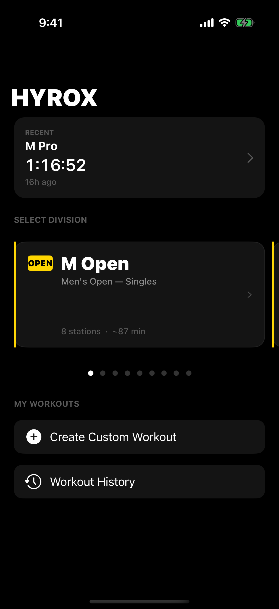
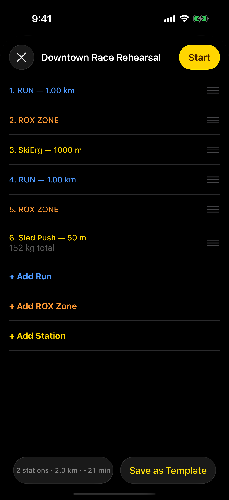
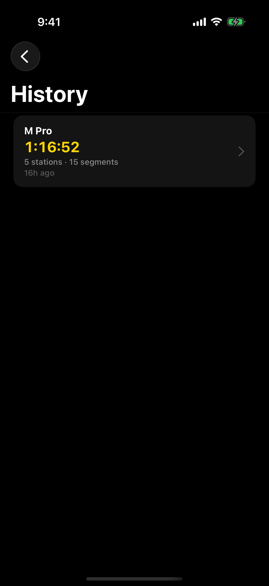
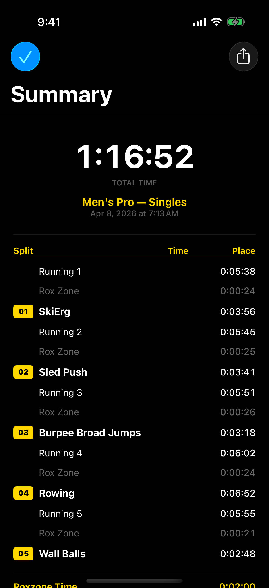
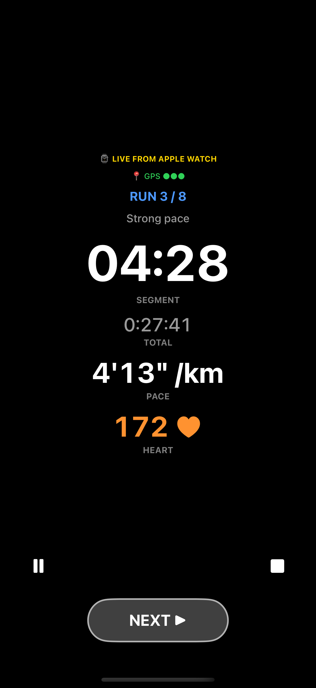
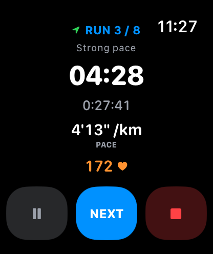
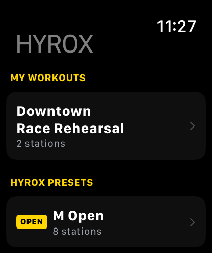
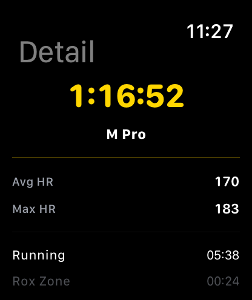

<div align="center">
  <h1>HYROX SIM</h1>
  <p><strong>HYROX race simulation for iPhone and Apple Watch</strong></p>
  <p>훈련 흐름을 설계하고, 손목에서 바로 따라가는 HYROX 시뮬레이터</p>

  <p>
    
    
    
    
  </p>

  <p>
    <a href="https://github.com/bbdyno/HyroxSim-iOS">GitHub</a> ·
    <a href="mailto:della.kimko@gmail.com">Email</a> ·
    <a href="https://buymeacoffee.com/bbdyno">Buy Me a Coffee</a> ·
    <a href="https://ko-fi.com/bbdyno">Ko-fi</a>
  </p>
</div>

---

## Overview

HYROX SIM은 iPhone과 Apple Watch에서 HYROX 스타일 워크아웃을 시뮬레이션하고, 운동 흐름을 설계하고, 최근 기록을 다시 확인할 수 있도록 만든 앱입니다.

HYROX SIM is an iPhone and Apple Watch app for simulating HYROX-style workouts, planning session flow, and reviewing recent workout records.

### Highlights

- 공식 디비전 프리셋과 커스텀 워크아웃 빌더를 함께 지원합니다.
- iPhone에서 세션을 준비하고 Apple Watch에서 현재 구간을 바로 따라갈 수 있습니다.
- 최근 운동 기록과 세션 요약 화면을 제공합니다.
- App Store 출시는 현재 준비 중입니다.

## Screens

<p align="center">
  
  
  
  
  
</p>

<p align="center">
  
  
  
  
</p>

## Product Structure

| Target | Platform | Role |
|---|---|---|
| `HyroxSim` | iOS | Main iPhone app built with UIKit |
| `HyroxSimWatch` | watchOS | Apple Watch companion app built with SwiftUI |
| `HyroxCore` | iOS + watchOS | Domain models, engine, formatters, and sync contracts |
| `HyroxPersistenceApple` | iOS + watchOS | SwiftData-based persistence |
| `HyroxLiveActivityApple` | iOS | Shared types for Live Activity and Dynamic Island |
| `HyroxSimWidgets` | iOS | Widget and Live Activity extension |

## Getting Started

### Requirements

| Item | Version |
|---|---|
| Xcode | 15.0+ |
| Tuist | 4.x |
| iOS | 17.0+ |
| watchOS | 10.0+ |
| Swift | 5.9+ |

### Setup

```bash
tuist install
tuist generate
open HyroxSim.xcworkspace
```

### Notes

- Capabilities include HealthKit and App Groups `group.com.bbdyno.app.HyroxSim`.
- The watchOS target includes HealthKit background delivery configuration.
- The repository contains a static marketing site under `docs/`.

## Repository Layout

```text
HyroxSim-iOS/
├── docs/                         # Static marketing site and screenshots
├── Targets/
│   ├── HyroxSim/                 # iOS app
│   ├── HyroxSimWatch/            # watchOS app
│   ├── HyroxCore/                # Shared core logic
│   ├── HyroxPersistenceApple/    # Persistence layer
│   ├── HyroxLiveActivityApple/   # Live Activity shared types
│   ├── HyroxSimTests/            # iOS tests
│   └── HyroxKitTests/            # Shared module tests
├── Project.swift
└── Tuist/Config.swift
```

## Support Me

If HYROX SIM is useful to you, you can support ongoing development here.

<p>
  <a href="https://buymeacoffee.com/bbdyno">
    
  </a>
  <a href="https://ko-fi.com/bbdyno">
    
  </a>
</p>

### Crypto Donation (BTC / ETH)

<details>
  <summary>Click to see wallet addresses</summary>

  <p><strong>BTC</strong>: <code>bc1qz5neag5j4cg6j8sj53889udws70v7223zlvgd3</code></p>
  <p><strong>ETH</strong>: <code>0x5f35523757d0e672fa3ffbc0f1d50d35fd6b2571</code></p>
</details>

> **Thanks for your support!**
>
> 커피 한 잔의 후원은 저에게 큰 힘이 됩니다. 감사합니다!
>
> Thanks for the coffee! Your support keeps me going.
>
> شكراً على القهوة! دعمك يعني لي الكثير.
>
> Danke fuer den Kaffee! Deine Unterstuetzung motiviert mich.
>
> Merci pour le cafe ! Votre soutien me motive.
>
> Gracias por el cafe! Tu apoyo me motiva a seguir.
>
> コーヒーの差し入れ、ありがとうございます！励みになります。
>
> 感谢请我喝杯咖啡！您的支持是我最大的动力。
>
> Terima kasih traktiran kopinya! Dukunganmu sangat berarti.

## Status

The app is not on the App Store yet. Release preparation is in progress.
